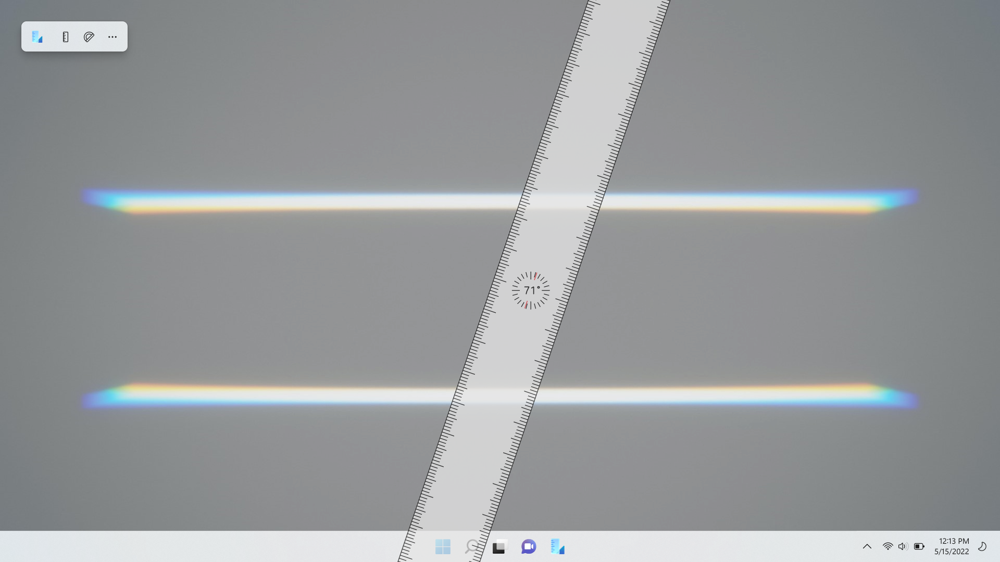

# Ruler

Welcome to the official issue-only repo for Ruler. Ruler is a desktop app that show a simple ruler on desktop. It primarily uses WPF and UWP (as XAML Islands).

Microsoft Store: https://www.microsoft.com/store/apps/9NW01D2M1CVD

Feel free to share ideas about new features or report bugs.